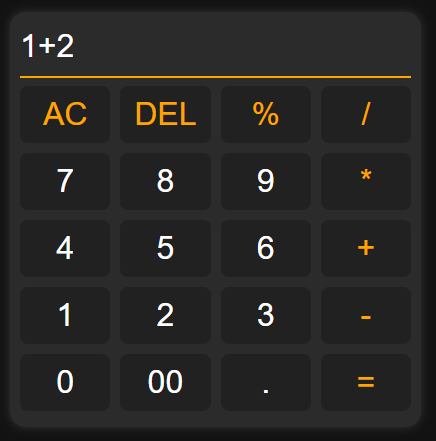

# Calculator  🧮
Creating a calculator can be a challenging and intricate task, and it is something that many web developers aspire to accomplish during their journey in web development. 🎇

## Preview 📷
 

  

