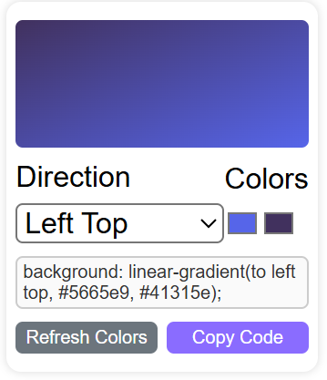

# Gradient Color Generator 🎨
As a web developer you should be familiar with Gradient Colors, this project can help you to find out how they work and after this you should be able to make one of them by yourself from scratch!! in any where 🎇

## Preview 📷
 

  

