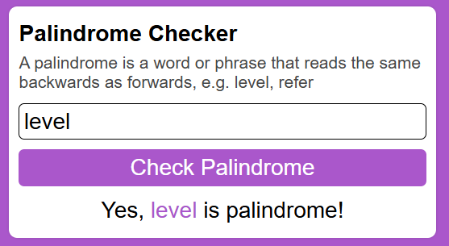

# Palindrome Checker 🔍
A palindrome checker determines if a word, phrase, or number reads the same forwards and backward, like “level” or “1234321”. 
It’s a beginner-friendly project that will help you practice string manipulation and logical thinking.

## Preview 📷
 

  

