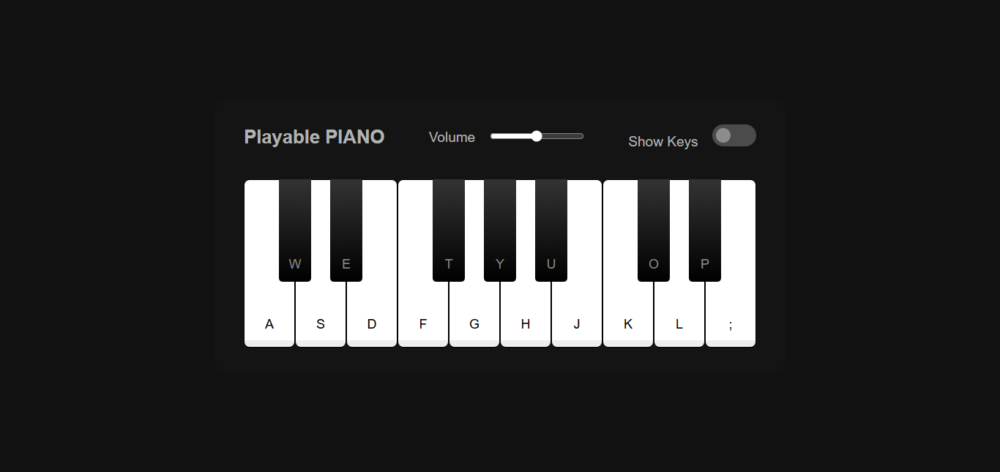

# Gradient Color Generator 🎨
An interactive piano app where users can play keys by clicking on them or using their keyboard. 🎹
Cloning this project involves DOM manipulation, event handling, audio control and breaking down the tasks

## Preview 📷
 

  

